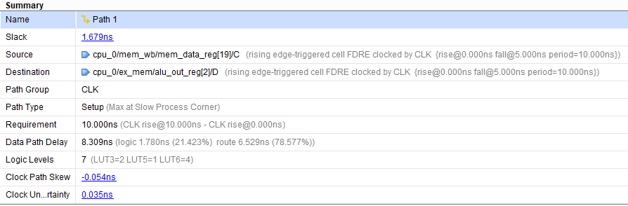
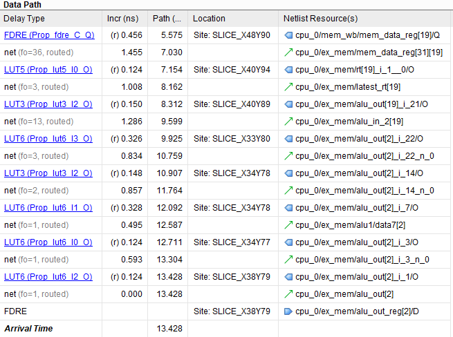

# 流水线 MIPS 处理器实验报告

> 无 16	李栋庭 2020011222


## 实验目的

1. 加深对现代处理器的基本工作原理的理解；
2. 掌握流水线处理器的设计方法。


## 设计方案

### 项目组成

**该项目分为如下部分：**

1. CPU 与主存

   该部分包括流水线 CPU 的功能模块以及指令、数据存储器。

2. 总线和外部设备

   该部分包含总线和一系列外设（七段数码管、LED 和串口）。


### 功能与特性

**本项目的流水线 MIPS CPU 具有如下功能与特性：**

1. 120+ MHz 主频
2. 5 级流水线 (IF, ID, EX, MEM, WB)
3. Forwarding 支持
   - 采用完全的 forwarding 电路解决数据关联问题
   - 对于 load-use 类竞争采取阻塞一个周期 + forwarding 的方法解决 
4. 分支与跳转 （未采用延迟槽）
   - 分支指令在 EX 阶段判断，分支发生时取消 IF 和 ID 阶段的两条指令 
   -  J 类指令在 ID 阶段判断，并取消 IF 阶段指令。
5. 支持 30 条 MIPS 指令
   - 存储访问指令： lw, sw
   - 算术指令： add, addu, sub, subu, addi, addiu, lui
   - 逻辑指令： and, or, xor, nor, andi, ori, sll, srl, sra, slt, slti, sltiu 
   - 分支和跳转指令: beq, bne, blez, bgtz, bltz 和 j, jal, jr, jalr 
6. 支持简单的异常（未定义指令异常）和中断的处理 
7. 1 Kbyte 指令存储器，1 Kbyte 数据存储器（当然可以通过修改参数变得很大）
8. 支持通过伪总线与外设交互（之所以叫伪总线，是因为只是借鉴总线思想，实际实现并不符合总线规范）
   - 控制七段数码管
   - 控制 LED 灯
   - 使用串口导入指令与数据，导出数据


### 数据通路图

下图为本项目的数据通路图。由于版面限制，部分控制信号与细节未标出。


## 原理详述与关键代码

本节将对照数据通路图与代码，详述本项目的关键原理与代码实现。

请注意：为了代码的简洁，本工程的所有流水线寄存器都没有定义输出端口，而通过操作符 `.` 访问其数据。 例如 `id_ex.MemWrite`。


### 转发 (Forwarding)

本 CPU 中的 forwarding 电路围绕模块 `ForwardControl` 实现。该模块的作用是当检测到数据冒险时，输出转发选择信号。

分析 CPU 中的转发路径（需要阻塞的情况将在后面考虑）：

- ID 阶段的 `jr` , `jalr` 需要使用到 `rs` 寄存器，因此需要有来自 EX/MEM, MEM/WB 的转发。
- 为了模拟寄存器堆 ”先写后读“ 的要求，ID 阶段的`rd` 也还需要来自 MEM/WB 的转发。
- EX 阶段需要来自 EX/MEM, MEM/WB 的转发。


下图是转发电路，注意有两次转发，第一次在 ID 阶段，第二次在 EX 阶段。


相关逻辑部分的代码见下：

> src/designs/cpu/ForwardControl.v

```verilog
always @ (*)
  begin
    if (~reset)
      begin
        // Forwarding for ID stage
        if (
          ex_mem_RegWrite
          && (ex_mem_write_addr != 0)
          && (ex_mem_write_addr == rs_addr)
        )
          ForwardA_ID = 2'b10;
        else if (
          mem_wb_RegWrite
          && (mem_wb_write_addr != 0)
          && (mem_wb_write_addr == rs_addr)
        )
          ForwardA_ID = 2'b01;
        else
          ForwardA_ID = 2'b00;

        // There is no need to forward for rt from ex_mem during ID,
        // because that will be done in EX
        if (
          mem_wb_RegWrite
          && (mem_wb_write_addr != 0)
          && (mem_wb_write_addr == rt_addr)
        )
          ForwardB_ID = 1;
        else
          ForwardB_ID = 0;

        // Forwarding for EX stage
        if (
          id_ex_RegWrite
          && (id_ex_write_addr != 0)
          && (id_ex_write_addr == rs_addr)
        )
          ForwardA_EX = 2'b10;
        else if (
          ex_mem_RegWrite
          && (ex_mem_write_addr != 0)
          && (ex_mem_write_addr == rs_addr)
        )
          ForwardA_EX = 2'b01;
        else
          ForwardA_EX = 2'b00;

        if (
          id_ex_RegWrite
          && (id_ex_write_addr != 0)
          && (id_ex_write_addr == rt_addr)
        )
          ForwardB_EX = 2'b10;
        else if (
          ex_mem_RegWrite
          && (ex_mem_write_addr != 0)
          && (ex_mem_write_addr == rt_addr)
        )
          ForwardB_EX = 2'b01;
        else
          ForwardB_EX = 2'b00;

      end
    else
      begin
        ForwardA_ID = 2'b00;
        ForwardB_ID = 0;
        ForwardA_EX = 2'b00;
        ForwardB_EX = 2'b00;
      end
  end
```


 ### 冒险 (Hazard)

本项目中需要解决的冒险为 数据冒险和控制冒险（此处不讨论已通过转发消除的冒险，中断和异常带来的冒险将在下一节讨论）。

#### 数据冒险


分析数据冒险的情况如下：

- 处于 EX 阶段的指令需要用到前一条指令的 MEM 阶段的结果
- 处于 ID 阶段的指令需要用到前一条指令的 EX 或 MEM 阶段的结果
- 处于 ID 阶段的指令需要用到前第二条指令的 MEM 阶段的结果


这部分的判断由模块 `HazardUnit` 完成，相应的控制信号为 `DataHazard`。相关逻辑部分的代码如下：

> src/designs/cpu/HazardUnit.v

```verilog
wire last =
     id_ex_write_addr != 0 &&
     (if_id_rs_addr == id_ex_write_addr || if_id_rt_addr == id_ex_write_addr);
wire second_last =
     ex_mem_write_addr != 0 &&
     (if_id_rs_addr == ex_mem_write_addr || if_id_rt_addr == ex_mem_write_addr);
wire lw = id_ex_MemRead && last;
wire jr =
     JumpReg && // Jump Register instr
     // the last instr will write to source reg (stall 1 & forward from EX needed)
     ((id_ex_RegWrite && last) ||
      // the second last instr will load data to source reg (stall 1 & forward from MEM needed)
      (ex_mem_MemRead && second_last)
      // and if the last instr will load data to source reg, the variable `lw` will handle it
     );

assign DataHazard = lw || jr;
```


#### 控制冒险

控制冒险的产生分为以下两种情况：

- 跳转语句和成功的分支语句
- 异常或中断（在下一节讨论）

我们定义了 `JumpHazard` 和 `BranchHazard` 信号来区分跳转与分支，相关信号由 `Control` 和 `BranchTest` 模块生成。对应文件为：

> src/designs/cpu/Control.v

> src/designs/cpu/BranchTest.v

此部分代码列出意义不大。`Control` 模块会在遇到跳转指令时将 `JumpHazard` 置 `1`, `BranchTest` 模块的功能是在分支指令的 EX 阶段检查分支条件是否成立，若成立则置 `BranchHazard` 为 `1`。


#### 冒险的处理

对冒险进行分析，有如下几种情况：

- 当 `DataHazard` 发生时，需要禁止 PC 和 IF/ID 流水线寄存器的写入。
- 当 `JumpHazard` 发生时，需要 Flush 掉 IF/ID 流水线寄存器。
- 当 `BranchHazard` 发生时，需要 Flush 掉 IF/ID, ID/EX 流水线寄存器。

相关的代码见下一节。


### 中断与异常

本项目定义的中断有 “定时器中断”，支持的异常有 “未定义指令异常”。

当 CPU 处于内核态时，新的中断与异常不被响应，因此设定了监督位 `Supervised = pc[31] || if_id.pc_next[31]`（`if_id.pc_next[31]` 对应从内核态切换回用户态时阻塞的一个周期）。`Supervised` 为 `1` 即表明 CPU 处于内核态。

`Control` 模块在 ID 阶段检测异常，响应中断。当 CPU 不为内核态时，具体的操作是：

- 发生中断或异常时，无条件地将 `Branch`, `MemRead`, `MemWrite` 信号置 `0`, `RegWrite` 信号置 `1` , `MemToReg` 信号置 `2'b10` (对应`pc_next`),  `RegDst` 信号置 `2'b11`  (对应`$k0`)。即把当前指令更改为将 `pc_next` 写入 `$k0` 寄存器。
- 若发生中断，置 `PCSrc` 信号为 `3'b011` ; 若发生异常，置 `PCSrc` 信号为 `3'b100`。
- 置 `ExceptionOrInterrupt` 信号为 `1`, 以允许 PC, IF/ID 流水线寄存器被写入（否则可能被 `DataHazard` 信号禁止），Flush 掉 IF/ID 流水线寄存器。
- `ExceptionOrInterrupt` 信号为 `1` 时，向后传入的 `pc_next` 信号由模块 `PCOnBreak` 提供（这是为了保证当中断发生在分支或跳转指令的 stall 区间时，还能正确返回到该分支或跳转语句。


下图是涉及到控制冒险、中断与异常处理的电路：


涉及对 PC, IF/ID, ID/EX 流水线寄存器操作的代码如下：

> src/designs/cpu/CPU.v

```verilog
// ...
ProgramCounter program_counter(
                 .clk(clk), .reset(reset), .wr_en(~DataHazard || ExceptionOrInterrupt),
                 .pc_next(pc_next), .pc(pc)
               );

// ...
IF_ID_Reg if_id(
            .clk(clk), .reset(reset), .wr_en(~DataHazard || ExceptionOrInterrupt),
            .Flush(ExceptionOrInterrupt || JumpHazard || BranchHazard),
            .instr_in(instruction), .pc_next_in(pc_plus_4)
          );

// ...
ID_EX_Reg id_ex(
            .clk(clk), .reset(reset), .Flush(DataHazard || BranchHazard),
            .shamt_in(if_id.instr[10:6]), .funct_in(if_id.instr[5:0]), 
    		.write_addr_in(write_addr),
            .rs_in(latest_rs_id), .rt_in(latest_rt_id), .imm_in(imm_out),
            .pc_next_in(ExceptionOrInterrupt ? pc_on_break : if_id.pc_next),
            .Branch_in(Branch), .BranchOp_in(BranchOp), .ALUOp_in(ALUOp), 
    		.ALUSrc1_in(ALUSrc1), .ALUSrc2_in(ALUSrc2),
            .ForwardA_EX_in(ForwardA_EX), .ForwardB_EX_in(ForwardB_EX),
            .MemRead_in(MemRead),	.MemWrite_in(MemWrite),
            .MemToReg_in(MemToReg), .RegWrite_in(RegWrite)
          );
```


涉及中断或异常时控制信号的生成的代码位于：

> src/designs/cpu/Control.v

此处不再贴出。


### CPU 各级流水线

建议配合前面的 [数据通路图](#数据通路图) 和下述文件中的代码阅读。

> src/designs/cpu/CPU.v

#### IF 级

IF 级包含通过总线获取指令、更新 PC 、写入 IF/ID 流水线寄存器的操作。

#### ID 级

ID 级包含控制信号、转发信号、中断与异常控制信号的生成，冒险的检测、跳转指令的控制，以及寄存器堆的读取、立即数的扩展和 ID/EX 流水线寄存器的写入。

#### EX 级

EX 级包含 ALU 运算，分支指令的判断与控制，以及 EX/MEM 流水线寄存器的写入。

#### MEM 级

MEM 级包含通过总线写入或读取内存或外设中的数据，以及写入 MEM/WB 流水线寄存器。

#### WB 级

 WB 级包含对寄存器堆的写入操作。

#### 流水线寄存器

> src/designs/cpu/pipeline_registers/*.v

MIPS 的五级流水线使用四个流水线寄存器来存放数据和控制信号。


### （伪）总线

> src/designs/cpu/Bus.v

 总线管理了指令存储器、数据存储器以及众多外设，负责根据 CPU 的控制信号对指定硬件进行读写操作。


### 外设

#### LED

> src/designs/external_devices/LED.v

| 地址范围（字节地址） | 功能     | 备注         |
| -------------------- | -------- | ------------ |
| 0x4000000C           | 外部 LED | 仅低 8 位有效，对应开发板上 8 个 LED 灯 |


#### 七段数码管

> src/designs/external_devices/SSD.v

| 地址范围（字节地址） | 功能       | 备注                                           |
| -------------------- | ---------- | ---------------------------------------------- |
| 0x40000010           | 七段数码管 | 0-7 bit 是数码管控制，8-11 bit 是 4 个阳极控制 |


#### 串口（硬件控制）

> - src/designs/external_devices/UART.v
> - src/designs/external_devices/UART_Rx.v
> - src/designs/external_devices/UART_Tx.v

后两个文件来自上学期的实验三。

串口模块的定义如下：

```verilog
module UART(
         clk, en, mode, ram_id, Rx_Serial, data_to_send,
         addr, on_received, recv_data, Tx_Serial,
         IM_Done, DM_Done
       );
```

| 端口         | 类型          | 备注                                     |
| ------------ | ------------- | ---------------------------------------- |
| en           | input         | 串口是否启用                             |
| mode         | input         | 0: 接收，1: 发送（仅对数据存储器有效）   |
| ram_id       | input         | 0: 指令存储器，1: 数据存储器             |
| Rx_Serial    | input         | 串口接收序列                             |
| data_to_send | input [31:0]  | 要发送的数据（自动控制）                 |
| addr         | output [31:0] | 指令存储器和数据存储器的地址（自动控制） |
| on_received  | output        | 接收到一个字的时候产生一个周期的高电平   |
| recv_data    | output [31:0] | 接收到的一个字                           |
| Tx_Serial    | output        | 串口发送序列                             |
| IM_Done      | output        | 指令存储器接收满                         |
| DM_Done      | output        | 数据存储器接收满/发送完毕                |


串口对 CPU 不可见，采用硬件方式控制。要使用串口模块，需要先停止 CPU （即置 `reset` 为 `1`），然后打开串口（`en` 置 `1`）。支持的操作如下：

| 操作     | mode | ram_id |
| -------- | ---- | ------ |
| 接收指令 | 0    | 0      |
| 接收数据 | 0    | 1      |
| 发送数据 | 1    | 1      |


接收完数据后，关闭串口并启动 CPU（即置 `en` 为 `0`，`reset` 为 `0`），自动开始执行指令。


## 仿真测试


### 本实验最短路径算法代码测试

我选择了 bellman 算法作为本次实验的最短路径算法。

测试的代码如下：

> src/testbenches/assembly/sssp_bellman.asm

```assembly
.text
main:

# Parameters
li $s7, 1024
li $t0, 0
li $a0,6
li $s0,6
addi $a1, $t0, 4    # set $a1 to &graph

data_in: 
li $t8,0
sw $t8,0($a1)
li $t8,9
sw $t8,4($a1)
li $t8,3
sw $t8,8($a1)
li $t8,6
sw $t8,12($a1)
li $t8,-1
sw $t8,16($a1)
li $t8,-1
sw $t8,20($a1)
addi $a1,$a1,128
li $t8,9
sw $t8,0($a1)
li $t8,0
sw $t8,4($a1)
li $t8,-1
sw $t8,8($a1)
li $t8,3
sw $t8,12($a1)
li $t8,4
sw $t8,16($a1)
li $t8,1
sw $t8,20($a1)
addi $a1,$a1,128
li $t8,3
sw $t8,0($a1)
li $t8,-1
sw $t8,4($a1)
li $t8,0
sw $t8,8($a1)
li $t8,2
sw $t8,12($a1)
li $t8,-1
sw $t8,16($a1)
li $t8,5
sw $t8,20($a1)
addi $a1,$a1,128
li $t8,6
sw $t8,0($a1)
li $t8,3
sw $t8,4($a1)
li $t8,2
sw $t8,8($a1)
li $t8,0
sw $t8,12($a1)
li $t8,6
sw $t8,16($a1)
li $t8,-1
sw $t8,20($a1)
addi $a1,$a1,128
li $t8,-1
sw $t8,0($a1)
li $t8,4
sw $t8,4($a1)
li $t8,-1
sw $t8,8($a1)
li $t8,6
sw $t8,12($a1)
li $t8,0
sw $t8,16($a1)
li $t8,2
sw $t8,20($a1)
addi $a1,$a1,128
li $t8,-1
sw $t8,0($a1)
li $t8,1
sw $t8,4($a1)
li $t8,5
sw $t8,8($a1)
li $t8,-1
sw $t8,12($a1)
li $t8,2
sw $t8,16($a1)
li $t8,0
sw $t8,20($a1)

addi $a1,$t0,4


# Call Bellman-Ford
jal  bellman_ford

li $s6,0
addi $t8,$t0,0

# Print results
li   $t0, 1
add $t1,$s7,$zero

li   $s6, 0

print_entry:
addi $t1, $t1, 4
lw   $a0, 0($t1)
add  $s6,$s6,$a0
addi $t0, $t0, 1
sub  $s5, $t0, $s0
bltz  $s5, print_entry

lui $t8, 0x4000
addi $a0,$t8,0x10
sw $s6, 0($a0)


loop:
j loop

#li $v0,17
#syscall

bellman_ford:
##### YOUR CODE HERE #####

# Initialization

add   $t1, $s7, $zero
sw   $zero, 0($t1)

li   $t0, 1
li   $t2, -1
init:
addi $t1, $t1, 4
sw   $t2, 0($t1)
addi $t0, $t0, 1
blt  $t0, $a0, init


# Relaxation for (n - 1) times
li   $t0, 1
RforT:

# Relaxation on every edge each time
move $t2, $zero 
RonE1:

li $t3, 0
RonE2:
addi $sp, $sp, -12
sw   $a1, 0($sp)
sw   $t0, 4($sp)
sw   $t2, 8($sp)

sll  $t5, $t2, 5
add  $t4, $t5, $t3

add   $t1, $s7, $zero
sll  $t2, $t2, 2
add  $t1, $t1, $t2
srl  $t2, $t2, 2
lw   $t5, 0($t1)    # dist[u]  

add   $t1,$s7,$zero
sll  $t3, $t3, 2
add  $t1, $t1, $t3
srl  $t3, $t3, 2
lw   $t6, 0($t1)    # dist[v]

sll  $t4, $t4, 2
add  $a1, $a1, $t4
srl  $t4, $t4, 2
lw   $t7, 0($a1)    # graph[addr]

seq  $t0, $t5, -1
seq  $t2, $t7, -1
or   $t0, $t0, $t2
bne  $t0, $zero, continue

seq  $t0, $t6, -1
add  $t5, $t5, $t7  # dist[u] + graph[addr]
sgt  $t2, $t6, $t5 
or   $t0, $t0, $t2
beq  $t0, $zero, continue

add   $t1, $s7,$zero
sll  $t3, $t3, 2
add  $t1, $t1, $t3
srl  $t3, $t3, 2
sw   $t5, 0($t1) 


continue:
lw   $a1, 0($sp)
lw   $t0, 4($sp)
lw   $t2, 8($sp)
addi $sp, $sp, 12

addi $t3, $t3, 1
blt  $t3, $a0, RonE2

addi $t2, $t2, 1
blt  $t2, $a0, RonE1

addi $t0, $t0, 1
blt  $t0, $a0, RforT

jr   $ra
```

启动 MARS 仿真器，使用相同的数据和代码进行测试，结果如下图（注：为了能在模拟器上运行，代码的初始化部分、数据读写并不相同，但计算最短路径的部分完全一致）。


8 + 3 + 5 + 10 + 8 = 34(10进制) = 22(16进制)

使用 MARS 中的 Dump machine code or data in an available format 功能将汇编指令转为 168 个 32 位无符号随机整数，存储在 `sssp_bellman.hex` 中，然后使用 `format_insturction.py` 生成对应指令格式的 `sssp_bellman.txt` 文件，并将该文件中的内容复制到 `InstructionMemory.v` 文件中。

仿真结果如下：


可以正确的计算出了最短路径之和 22(16进制) 并存储在 22 号寄存器中，并且 ssd 依次输入对应的数据流。


生成比特流后，烧录进 FPGA。然后 CPU 开始计算最短路径。

计算结束后，输出所有最短路径之和，如下图：


发现 mars，CPU，仿真的最短路径之和互相吻合，均为 22（16进制）。


## 综合情况

### 面积分析

如下图所示，总共使用了 2269 个查找表（其中 1757 个被用于逻辑， 512 个被用于存储），1633 个寄存器。


### 时序性能分析

如下图，WNS 为 1.679 ns。因此得该 CPU 理论工作频率为 
$$1 \div (10 ns - 1.679 ns) \approx 120.18 MHz。 $$


分析关键路径：






由 Data Path 可以看出，时钟上升沿来临时，先从 MEM/WB 流水线寄存器获得了指令，然后从寄存器堆中读取 `rt` 寄存器，再经过转发单元控制，获得最新的 `rt`, 即 `latest_rt_id`, 然后把其值传递给 EX/MEM, 进行计算，因此，这应该对应 R 型指令的 EX 阶段。


## 硬件调试情况

在硬件调试的过程中，我遇到了许多问题，在我仿真完成的时候，我以为马上就要完成本次实验了，结果上板子的困难超出我的想象。如上面的显示，我使用 `clk_gen.v` 分频来实现 ssd 数据的轮换，但是我一直行为级仿真正确，在板子上什么也显示不出来。

我一直尝试修改代码，例如只使用 ssd 作为 top 而不用 cpu 进行仿真和上板子，但是板子上仍然什么都显示不出来，这时我查看了电路结构，发现：


为什么有的线是断的呢，我想这应该就是数码管不亮的原因，然后我查看 `ssd.v` 文件，发现是因为某些变量在多个 `always` 操作里面都改变了值，导致多线程冲突的问题，所以我把那些变量的改变都放在相同的 `always` 中，板子上成功显示出了数字。


但是还是不对，这个原因就比较简单了，是因为新的板子 0 和 1 表示的亮暗与之前的板子是反的，改完之后，终于显示正确了！！！


## 性能分析

启动 MARS 仿真器，使用相同的数据和代码进行测试，结果如下图（注：为了能在模拟器上运行，代码的初始化部分、数据读写并不相同，但计算最短路径的部分完全一致）。通过 MARS 中的 Tools/Instruction Statistics 得到执行的指令情况如下图：


仿真时，运行周期数如下图所示


因此，有
$$
{\rm CPI}=\frac{clocks}{instr\_num}=\frac{8762}{8368}=1.0471
$$
考虑 CPU 的主频为 120.18 MHz, 故平均每秒执行指令数为
$$
n=\frac{freq}{{\rm CPI}}=\frac{120.18 \ {\rm M}}{1.0471}=114.77 \ {\rm M}
$$


## 思想体会


在本次实验中，我深刻体会到了硬件调试的艰辛和乐趣。我不仅对 MIPS 流水线 CPU 有了更深入的了解，也锻炼了我的编程能力和解决问题的能力。

首先，我在构建流水线 CPU 的过程中，对 CPU 的工作原理有了更深入的了解。从单周期开始，一步一步地添加功能和优化性能，我体会到了流水线寄存器、转发、冒险、中断、异常、外设等等概念的实际意义和作用。我也学会了如何编写各种汇编程序来测试 CPU 的功能和性能。当看见烧在板子上的 CPU 能够跑着各种汇编程序时，我感到非常自豪。


其次，我在硬件调试的过程中，遇到了许多问题，有些是代码逻辑上的错误，有些是电路结构上的问题，有些是板子本身的特性。每一个问题都需要我仔细分析、查找资料、尝试修改、反复测试。在这个过程中，我学会了如何使用 clk_gen.v 分频来实现 ssd 数据的轮换，如何避免多线程冲突的问题，如何适应不同板子的特性等等。我也发现了一些之前没有注意到的细节，例如某些变量在多个 always 操作里面都改变了值，导致电路结构中有的线是断的。当我最终解决了所有的问题，看到板子上成功显示出了数字，我感到非常有成就感。

最后，我在本项目中，也提高了我的编程能力和开发效率。在开始本项目前，我先花了不少时间调研开发 verilog 项目的最佳环境，最终配置了一套舒适的开发工具，并且在之后的过程中，不断增加自动化小工具。这些工具让我能够更方便地编写代码、进行仿真、查看波形、烧录板子等等。我也学会了如何使用 git 等版本控制工具来管理代码和文档。

总之，本次实验让我收获满满！在此，还要感谢老师和助教的辛苦付出和指导！

## 文件清单

需要在 Vivado 2017.4 中建立该项目。


文件清单如下：

>Pipeline   
>├─ Report.pdf  
>├─ src  
>│    ├─ constraints  
>│    │    └─ top.xdc  
>│    ├─ designs  
>│    │    ├─ cpu  
>│    │    │    ├─ ALU.v  
>│    │    │    ├─ ALUControl.v   
>│    │    │    ├─ BranchTest.v    
>│    │    │    ├─ Bus.v   
>│    │    │    ├─ clk_gen.v   
>│    │    │    ├─ CPU.v    
>│    │    │    ├─ Control.v  
>│    │    │    ├─ DataMemory.v    
>│    │    │    ├─ ForwardControl.v  
>│    │    │    ├─ HazardUnit.v  
>│    │    │    ├─ InstructionMemory.v  
>│    │    │    ├─ PCOnBreak.v  
>│    │    │    ├─ ProgramCounter.v  
>│    │    │    ├─ RegisterFile.v  
>│    │    │    └─ pipeline_registers  
>│    │    │           ├─ EX_MEM_Reg.v   
>│    │    │           ├─ ID_EX_Reg.v  
>│    │    │           ├─ IF_ID_Reg.v   
>│    │    │           └─ MEM_WB_Reg.v  
>│    │    ├─ external_devices  
>│    │    │    ├─ LED.v  
>│    │    │    ├─ SSD.v  
>│    │    │    ├─ SysTick.v  
>│    │    │    ├─ Timer.v  
>│    │    │    ├─ UART.v  
>│    │    │    ├─ UART_Rx.v  
>│    │    │    └─ UART_Tx.v  
>│    │    └─ top.v  
>│    └─ testbenches  
>│           ├─ test_cpu_behav.wcfg    
>│           ├─ assembly  
>│           │    ├─ sssp_mybellman.txt  
>│           │    ├─ sssp_mybellman.asm    
>│           │    └─ sssp_mybellman.hex  
>│           └─ test_cpu.v   
>└─ utilities  
>       └─ format_insturction.py  

